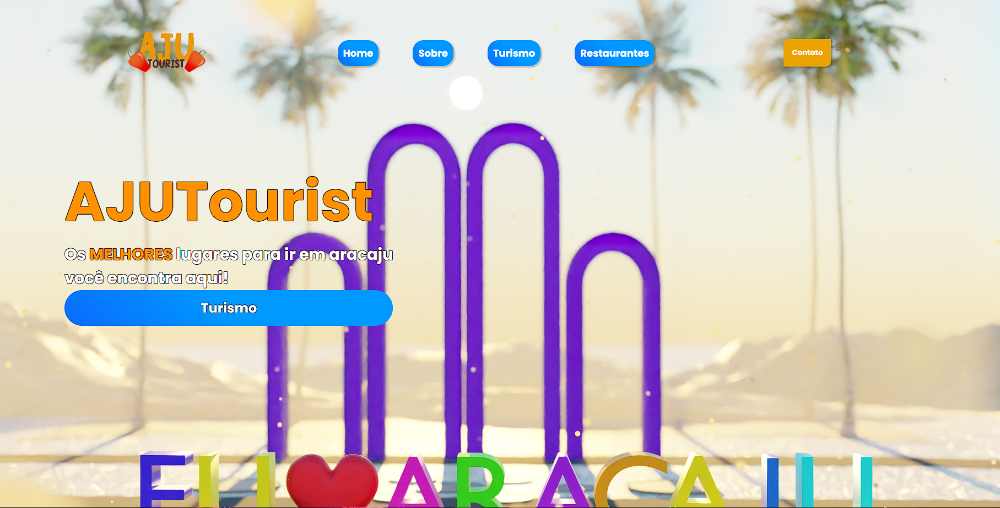

<h1 align="center">AJUTourist</h1>

  <a href="#-tecnologias">Tecnologias</a>&nbsp;&nbsp;&nbsp;|&nbsp;&nbsp;&nbsp;
  <a href="#-projeto">Projeto</a>&nbsp;&nbsp;&nbsp;|&nbsp;&nbsp;&nbsp;
  <a href="#memo-licença">Licença</a>

  

 

## 🔗 Link

https://eudlayfelipe.github.io/SiteTuristicoAJU/

## 🚀 Tecnologias

Esse projeto foi desenvolvido com as seguintes tecnologias:

- HTML, CSS e JAVASCRIPT

- Git e Github

## 💻 Projeto

Feito a principio para ser usado como portifólio e uma atividade da faculdade, podendo ser utilizado de forma profissional em um furturo próximo.

## :memo: Licença

Esse projeto está sob licença deste usuário.

---

Feito com ♥ by EudlayFelipe
# SiteTuristicoAJU
